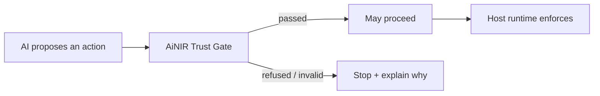
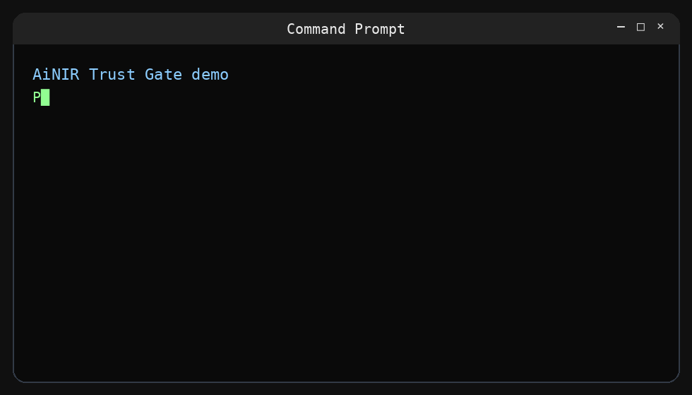
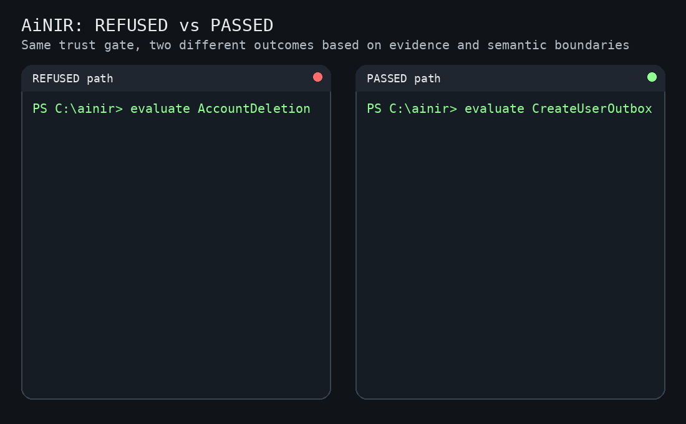
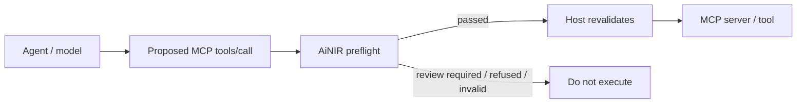
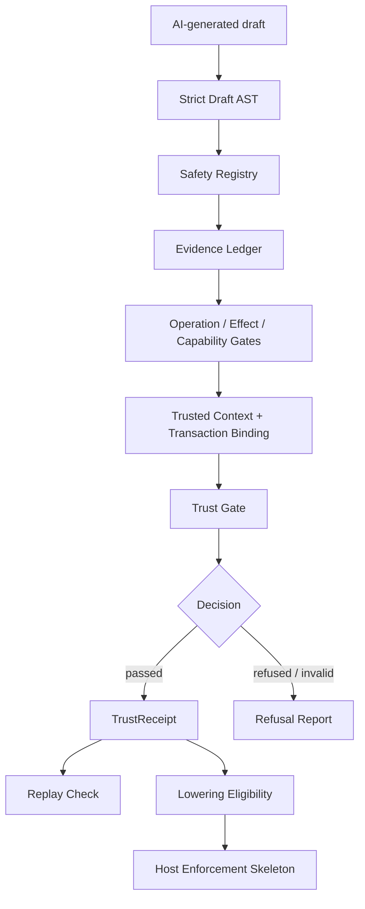

# AiNIR


> **Model output is a claim, not a fact.**

AiNIR checks AI-generated workflow semantics **before a host runtime is allowed to lower, hand off, or execute them**.


```mermaid
flowchart LR
    A[AI proposes an action] --> B[AiNIR Trust Gate]
    B -->|passed| C[May proceed]
    B -->|refused / invalid| D[Stop + explain why]
    C --> E[Host runtime enforces]
```

Think of AiNIR as a semantic checkpoint between an AI agent's proposal and the system that could make that proposal real.

> **Current release:** bounded v1.0 RC public demo. It is not a production execution runtime and does not claim to verify arbitrary AI-generated code.

Created by **Lee Yoon Kyu** under **AIOE**.

## See it in 30 seconds

<p align="center">
  
</p>

An AI-generated draft proposes a permanent account deletion:

```yaml
workflow: AccountDeletion
operations:
  - op: auth.check_account_deletion_authorization
  - op: db.hard_delete_user
    effects: [effect.destructive.account.hard_delete]
    capabilities: [cap.account.delete.hard]
```

AiNIR does not treat the draft as executable truth. It evaluates the registered workflow semantics, evidence, effects, capabilities, trusted context, and transaction requirements before deciding whether it may move forward.

The bundled demo intentionally produces both refusals and a safe pass:

```text
AiNIR public demo: passed
- account_deletion_hard_delete_blocked: blocked (10 critical)
- create_user_outbox_safe: passed (0 critical)
- order_payment_real_payment_blocked: blocked (16 critical)
- password_reset_raw_token_blocked: blocked (11 critical)
- pii_export_raw_pii_blocked: blocked (17 critical)
```

That is the core idea:

**AI proposes. AiNIR checks whether the proposal has earned the right to proceed. The host still owns execution.**

<p align="center">
  
</p>

## Why this exists

AI agents can produce output that is structurally valid but semantically unsafe.

A JSON schema can tell you whether a document has the right shape. Tool metadata can describe what a tool looks like. A sandbox can contain execution after it starts. Host authorization can decide who may access a resource.

AiNIR addresses a different question:

> **Are the proposed program semantics sufficiently supported, bounded, and internally consistent to move toward execution at all?**

AiNIR checks things such as:

- whether claimed operations match registered operation contracts;
- whether effects and capabilities stay inside reviewed boundaries;
- whether required evidence is ledger-bound instead of model self-attestation;
- whether policy evaluation uses trusted host context rather than draft-provided metadata;
- whether required transaction boundaries are explicit;
- whether a passed decision can issue a replayable `TrustReceipt`.

## Quick start

Run from the repository root. The public demo only needs the package's runtime dependencies; contributor/test tooling is optional.

### macOS / Linux

```bash
python -m venv .venv
source .venv/bin/activate
pip install -e .
python -m ainir demo --out-dir "${TMPDIR:-/tmp}/ainir_demo_results"
```

### Windows PowerShell

```powershell
python -m venv .venv
. .venv\Scripts\Activate.ps1
pip install -e .
python -m ainir demo --out-dir "$env:TEMP\ainir_demo_results"
```

If you plan to run the full test suite or contributor checks, install the development extras with `pip install -e ".[dev]"`.

Then inspect a single Trust Gate decision:

```bash
python -m ainir trust evaluate examples/create_user_outbox_safe/draft.yaml --json --out-dir /tmp/ainir_trust_gate
```

On Windows PowerShell, replace `/tmp/...` with `$env:TEMP\...`.

Want only the shortest path? Start with [`START_HERE.md`](START_HERE.md).

## Public examples

| Scenario | What the demo is testing | Expected |
|---|---|---|
| [Account deletion](examples/account_deletion_hard_delete_blocked/) | irreversible hard-delete workflow | refused |
| [Real payment](examples/order_payment_real_payment_blocked/) | irreversible financial effect | refused |
| [Password reset](examples/password_reset_raw_token_blocked/) | raw secret persistence marker | refused |
| [PII export](examples/pii_export_raw_pii_blocked/) | unprotected PII handling | refused |
| [Create user + outbox](examples/create_user_outbox_safe/) | transaction-bound outbox workflow | passed + lowerable |

See [`examples/README.md`](examples/README.md) for a guided tour.

## Where AiNIR fits

AiNIR is useful when an AI system can propose actions that have consequences outside the model itself, for example:

- agent-generated database or account operations;
- tool calls with sensitive capabilities;
- MCP tool-call preflight;
- workflows involving payments, secrets, PII, or destructive effects;
- handoff from model-generated intent into a host-controlled execution layer.

AiNIR does **not** replace host authorization, sandboxing, policy enforcement, authentication, or runtime security. It sits before those controls as a semantic trust boundary.

## MCP: put a semantic checkpoint before `tools/call`

If an agent can propose an MCP tool call, a useful placement is:


```mermaid
flowchart LR
    A[Agent / model] --> B[Proposed MCP tools/call]
    B --> C[AiNIR preflight]
    C -->|passed| D[Host revalidates]
    C -->|review required / refused / invalid| E[Do not execute]
    D --> F[MCP server / tool]
```

The bundled reference example proposes this call:

```json
{
  "method": "tools/call",
  "params": {
    "name": "workspace.read_text",
    "arguments": {"path": "docs/README.md"}
  }
}
```

The host-owned context separately says that the server is authenticated, schema validation passed, `cap.resource.read` is granted, the resource is inside `scope.workspace.docs`, and explicit consent is currently valid. AiNIR evaluates those bindings against the reviewed MCP profile instead of trusting the model or tool description alone.

```bash
python -m ainir mcp assess \
  examples/mcp_tool_call/tool_descriptor.json \
  examples/mcp_tool_call/tool_call.json \
  examples/mcp_tool_call/transport_binding.json \
  examples/mcp_tool_call/host_input.json \
  --out-dir /tmp/ainir_mcp_assessment --json
```

For the reviewed `workspace.read_text` contract, the maximum decision is `passed`. A passed assessment still does **not** mean AiNIR contacted the MCP server or executed the tool: the host must revalidate authorization and resource identity at time of use.

The same reference profile also demonstrates why semantic classification matters: reviewed writes require transaction and rollback bindings, while reviewed delete operations can require human review instead of silently becoming executable.

See [`examples/mcp_tool_call/README.md`](examples/mcp_tool_call/README.md), [`docs/mcp_tool_call_profile.md`](docs/mcp_tool_call_profile.md), and [`docs/mcp_profile_authoring.md`](docs/mcp_profile_authoring.md).

AiNIR also includes a host-owned adapter for completed OpenAI Responses `function_call` artifacts. It consumes already-observed JSON and does not call the OpenAI API, execute the function, or submit tool output. See [`examples/openai_function_tool/README.md`](examples/openai_function_tool/README.md) and [`docs/openai_function_tool_host_adapter.md`](docs/openai_function_tool_host_adapter.md).

## How it works


```mermaid
flowchart TD
    A[AI-generated draft] --> B[Strict Draft AST]
    B --> C[Safety Registry]
    C --> D[Evidence Ledger]
    D --> E[Operation / Effect / Capability Gates]
    E --> F[Trusted Context + Transaction Binding]
    F --> G[Trust Gate]
    G --> H{Decision}
    H -->|passed| I[TrustReceipt]
    H -->|refused / invalid| J[Refusal Report]
    I --> K[Replay Check]
    I --> L[Lowering Eligibility]
    L --> M[Host Enforcement Skeleton]
```

A few AiNIR terms in plain language:

- **Trust Gate** — the final semantic checkpoint that decides whether a draft may proceed.
- **Evidence Ledger** — registered evidence bindings that the model cannot create merely by asserting they exist.
- **TrustReceipt** — a replayable record of a passed trust decision and the registry state behind it.
- **Lowering** — converting a verified semantic draft toward a host-consumable implementation form. Lowering is not execution.
- **Profile** — a bounded, additive set of reviewed workflow semantics and conformance cases.

## What makes AiNIR different from adjacent controls?

| Control | Main question |
|---|---|
| JSON / schema validation | Is the data shaped correctly? |
| Authentication / authorization | Who may access this resource? |
| Sandbox / runtime isolation | Where may code run, and what can it touch? |
| Policy engine | Does this request match configured policy rules? |
| **AiNIR** | **Are the proposed semantics sufficiently evidenced and bounded to move toward execution?** |

These layers are complementary. AiNIR is not presented as a replacement for the others.

## Tested, not merely claimed

The public RC is intentionally closed-world and fail-closed.

Its public pass/refusal paths are exercised through:

- defensive negative conformance cases;
- fixed golden traces;
- Trust Gate decision validation;
- `TrustReceipt` issue / verify / replay flows;
- registry snapshot and evolution checks;
- additive profile conformance;
- bounded MCP preflight cases.

Run focused checks with:

```bash
python -m ainir conformance negative
python -m ainir conformance golden
python -m ainir conformance private-trial
```

## Bounded public demo scope and guarantees

This repository is a **pre-v1, bounded v1.0 RC candidate public demo**. It is **not a v1.0 final** and **not a production runtime**.

The current public implementation is intentionally **closed-world**. Its **workflow registry** recognizes a bounded set of reviewed workflows; unknown workflows are refused instead of guessed.

The current public claim is deliberately narrow:

- model-generated workflow drafts are treated as semantic claims;
- known workflow profiles are checked against registered evidence, effects, capabilities, operation contracts, trusted context, transaction boundaries, and lowering gates;
- unknown workflows are refused instead of guessed;
- the public pass/refusal paths are covered by negative conformance cases, golden traces, and receipt replay.

It does **not** claim to:

- verify arbitrary AI-generated code semantics;
- cover every enterprise workflow;
- provide a production evidence backend;
- provide a complete enterprise effect taxonomy;
- replace host runtime security controls;
- execute real external side effects.

Production use would require workflow-registry governance, external evidence providers, canonical effect taxonomies, registry snapshot management, and profile-specific conformance packs.

For the precise claim boundary, read [`docs/positioning_and_scope.md`](docs/positioning_and_scope.md), [`docs/v1_known_limitations.md`](docs/v1_known_limitations.md), and [`PUBLIC_SCOPE.md`](PUBLIC_SCOPE.md).

## Go deeper

Choose the path that matches what you want to do:

- **Try AiNIR quickly:** [`START_HERE.md`](START_HERE.md)
- **Understand the architecture:** [`docs/README.md`](docs/README.md), [`docs/trust_gate.md`](docs/trust_gate.md), [`docs/artifact_contracts.md`](docs/artifact_contracts.md)
- **Author profiles:** [`docs/profile_authoring.md`](docs/profile_authoring.md), [`docs/profile_conformance.md`](docs/profile_conformance.md)
- **Understand evidence:** [`docs/evidence_provider_interface.md`](docs/evidence_provider_interface.md), [`docs/offline_evidence_providers.md`](docs/offline_evidence_providers.md)
- **Understand replay and registry evolution:** [`docs/trust_receipt_persistence.md`](docs/trust_receipt_persistence.md), [`docs/trust_receipt_registry_evolution.md`](docs/trust_receipt_registry_evolution.md)
- **Review the RC scope:** [`docs/v1_rc_candidate.md`](docs/v1_rc_candidate.md), [`docs/v1_rc_scope.md`](docs/v1_rc_scope.md), [`docs/v1_roadmap.md`](docs/v1_roadmap.md)
- **Prepare public launch copy:** [`docs/public_launch_kit.md`](docs/public_launch_kit.md)
- **Contribute:** [`CONTRIBUTING.md`](CONTRIBUTING.md), [`PROTECTED_INVARIANTS.md`](PROTECTED_INVARIANTS.md), [`SECURITY.md`](SECURITY.md)

## Author and license

- Author / maintainer: **Lee Yoon Kyu**
- Organization / project studio: **AIOE**
- License: **Apache-2.0**
