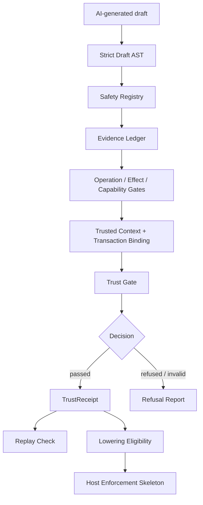

# AiNIR


> **Model output is a claim, not a fact.**

AiNIR is a **v1.0 release-candidate public demo** of a semantic trust layer for inspecting AI-generated program semantics before they are lowered, handed off, or executed by a host runtime.

A model may propose a workflow. AiNIR asks whether that proposal is trustworthy enough to move forward: Are effects declared? Are capabilities minimal? Is the evidence ledger-bound? Is the runtime context trusted? Are transaction boundaries explicit? Can the draft be lowered safely?

Created by **Lee Yoon Kyu** under **[AIOE]**.

## At a glance

AiNIR is a compact public demo of a trust boundary for AI-generated program semantics, now packaged as a **v1.0 RC candidate** for final scope review.


```mermaid
flowchart TD
    A[AI-generated draft] --> B[Strict Draft AST]
    B --> C[Safety Registry]
    C --> D[Evidence Ledger]
    D --> E[Operation / Effect / Capability Gates]
    E --> F[Trusted Context + Transaction Binding]
    F --> G[Trust Gate]
    G --> H{Decision}
    H -->|passed| I[TrustReceipt]
    H -->|refused / invalid| J[Refusal Report]
    I --> K[Replay Check]
    I --> L[Lowering Eligibility]
    L --> M[Host Enforcement Skeleton]
```

The public demo includes drafts that should be refused and one safe workflow that can be lowered into a host-enforcement TypeScript skeleton.

| Example | What it checks | Expected |
|---|---|---|
| `password_reset_raw_token_blocked` | synthetic secret persistence marker | refused |
| `order_payment_real_payment_blocked` | irreversible financial-effect marker | refused |
| `pii_export_raw_pii_blocked` | unprotected PII marker | refused |
| `account_deletion_hard_delete_blocked` | irreversible deletion marker | refused |
| `create_user_outbox_safe` | transaction-bound outbox pattern | passed + lowerable |

## Current status

This repository is a **v1.0 RC candidate public demo**.

It is **not a v1.0 final**. It is **not a production runtime**. It remains a conservative pre-v1-to-v1 transition package until final scope review is complete.

It is not:

- a v1.0 final release;
- a production compiler;
- a production execution runtime;
- a replacement for host-level security controls;
- the full private research archive.

The larger private review package, extended workflow suite, private reports, and enterprise policy packs are intentionally not included here.


## What this RC candidate actually claims

AiNIR does **not** claim to verify arbitrary AI-generated code semantics today.

This public RC candidate demonstrates a narrower, testable claim:

- model-generated workflow drafts are treated as semantic claims;
- known workflow profiles are checked against registered evidence, effects, capabilities, operation contracts, trusted context, transaction boundaries, and lowering gates;
- unknown workflows are refused instead of guessed;
- every public pass/refusal path is covered by negative conformance cases, golden traces, and TrustReceipt replay.

The longer-term infrastructure path is **profile-based**: workflow profiles, canonical effect contracts, evidence-provider governance, registry versioning, and consumer conformance packs. P5 now includes deterministic offline fixture/file/signed-bundle provider contracts, but their output remains an untrusted candidate and is not automatically promoted into the Trust Gate Evidence Ledger. AiNIR becomes more useful by making those profiles and evidence boundaries governable, not by pretending that one demo registry covers every enterprise workflow.

P6 additionally provides a bounded, consumer-neutral MCP `tools/call` preflight profile. It binds reviewed descriptors, effects, capabilities, host-observed authorization audience, resource scope, explicit consent, and transaction/rollback readiness, but it never contacts or executes an MCP server. Destructive calls are capped at `review_required`; MCP Tasks and multi-round input are outside this public P6 claim.

P7 adds a fixed-semantics read-only MCP profile scaffold and a host-owned adapter for completed OpenAI Responses `function_call` items. The adapter requires `strict: true`, exact reviewed input-schema binding, completed source artifacts, and the existing P6 host checks. It imports no OpenAI SDK, calls no API, submits no tool output, and executes no function.

## Bounded public demo scope

The public RC candidate is intentionally closed-world. It recognizes a small workflow registry and refuses unknown workflows instead of guessing their semantics.

This is a demo-safety boundary, not a claim that AiNIR can verify every enterprise workflow today. Production use would require workflow registry governance, external evidence providers, canonical effect taxonomies, registry snapshot management, and profile-specific conformance packs. See [`docs/positioning_and_scope.md`](docs/positioning_and_scope.md), [`docs/v1_known_limitations.md`](docs/v1_known_limitations.md), and [`docs/v1_roadmap.md`](docs/v1_roadmap.md).

## Quick start

Run from the repository root. The demo writes reports to your OS temp directory so the checkout stays clean.

**macOS / Linux**

```bash
python -m venv .venv
source .venv/bin/activate
pip install -e ".[dev]"
python -m ainir demo --out-dir "${TMPDIR:-/tmp}/ainir_demo_results"
```

**Windows PowerShell**

```powershell
python -m venv .venv
. .venv\Scripts\Activate.ps1
pip install -e ".[dev]"
python -m ainir demo --out-dir "$env:TEMP\ainir_demo_results"
```

Expected result:

```text
AiNIR public demo: passed
- account_deletion_hard_delete_blocked: blocked (10 critical)
- create_user_outbox_safe: passed (0 critical)
- order_payment_real_payment_blocked: blocked (16 critical)
- password_reset_raw_token_blocked: blocked (11 critical)
- pii_export_raw_pii_blocked: blocked (17 critical)
```

Run the local private-trial simulation:

```bash
python -m ainir conformance private-trial
```

Inspect an installed public schema without deriving package paths:

```python
from ainir.resources import read_schema_text, public_resource_manifest

receipt_schema = read_schema_text("trust_receipt.schema.json")
resource_manifest = public_resource_manifest()
```

Verify wheel, source-distribution, installed-resource, Trust Gate, and receipt-replay contracts:

```bash
python scripts/check_distribution_contracts.py
```

Run focused checks. On Windows PowerShell, replace `/tmp/...` with `$env:TEMP\...`, or set `AINIR_TEMP_ROOT` before running scripts.

```bash
python -m ainir conformance negative --out-dir /tmp/ainir_negative_conformance
python -m ainir conformance golden --out-dir /tmp/ainir_golden_traces
python scripts/run_prelaunch_check.py
python scripts/run_release_candidate_review.py
```

Create and test an additive workflow profile without changing Trust Gate core code:

```bash
python -m ainir profile init profiles/example-audit --profile-id example.audit.v1 --workflow-id AuditRequest
python -m ainir profile validate profiles/example-audit/profile.yaml
python -m ainir conformance run profiles/example-audit/profile.yaml --out-dir /tmp/ainir_example_profile
```

The bundled public profile is addressable as `ainir.public-demo.v1` and currently unifies the 10 golden traces and 71 defensive negative cases in one conformance report. Profiles are additive and context-local; they cannot replace protected registry entries, authorize execution, define new effect aliases/taxonomies, or widen exact capability contracts with families or prefixes.

Capture and compare registry state, then perform a current-registry replay without changing the historical receipt:

```bash
python -m ainir receipt issue examples/create_user_outbox_safe/draft.yaml --out-dir /tmp/ainir_receipts --json
python -m ainir registry snapshot --evolution --out /tmp/ainir_current_registry.json --json
python -m ainir registry diff /tmp/ainir_current_registry.json /tmp/ainir_current_registry.json --json
```

Migrated replay additionally requires an explicit RegistryMigrationRecord. Cryptographic signatures are not implemented in this RC; unsigned local approval is refused unless the caller explicitly acknowledges that limitation. See [`docs/trust_receipt_registry_evolution.md`](docs/trust_receipt_registry_evolution.md).

Validate a deterministic offline evidence candidate without promoting it into the Trust Gate ledger:

```bash
python -m ainir evidence bundle examples/offline_evidence_provider/bundle.json --json
python -m ainir evidence policy examples/offline_evidence_provider/policy.json --json
python -m ainir evidence resolve \
  examples/offline_evidence_provider/bundle.json \
  examples/offline_evidence_provider/policy.json \
  examples/create_user_outbox_safe/draft.yaml \
  --claim-id claim.create_user_uses_outbox \
  --evidence-id evidence.ainir.fixture.safe-outbox \
  --expected-kind verifier_report \
  --evaluation-time 2026-08-10T00:00:00Z \
  --json
```

A successful result is `validated_candidate` with `trust_gate_promotion_allowed: false`. See [`docs/offline_evidence_providers.md`](docs/offline_evidence_providers.md).

Assess a bounded MCP tool call without contacting or executing a server:

```bash
python -m ainir mcp profile
python -m ainir mcp assess \
  examples/mcp_tool_call/tool_descriptor.json \
  examples/mcp_tool_call/tool_call.json \
  examples/mcp_tool_call/transport_binding.json \
  examples/mcp_tool_call/host_input.json \
  --out-dir /tmp/ainir_mcp_assessment
python -m ainir mcp conformance --out-dir /tmp/ainir_mcp_conformance
```

A passing assessment is only a host-preflight result. AiNIR does not execute the tool, forward credentials, or replace host authorization and sandboxing. See [`docs/mcp_tool_call_profile.md`](docs/mcp_tool_call_profile.md).

Assess a proposed MCP tool call without contacting or executing a server:

```bash
python -m ainir mcp profile
python -m ainir mcp assess \
  examples/mcp_tool_call/tool_descriptor.json \
  examples/mcp_tool_call/tool_call.json \
  examples/mcp_tool_call/transport_binding.json \
  examples/mcp_tool_call/host_input.json \
  --out-dir /tmp/ainir_mcp_assessment --json
python -m ainir mcp conformance --out-dir /tmp/ainir_mcp_conformance
```

Tool descriptions and annotations remain untrusted. The host owns authentication, authorization audience, schema validation, capabilities, resource resolution, explicit consent, transactions, rollback, and all execution. See [`docs/mcp_tool_call_profile.md`](docs/mcp_tool_call_profile.md).

Capture and compare portable registry snapshots, then replay a receipt without rewriting its history:

```bash
python -m ainir receipt issue examples/create_user_outbox_safe/draft.yaml --out-dir /tmp/ainir_receipts
python -m ainir registry snapshot --evolution --out /tmp/current-registry.json
python -m ainir registry diff /tmp/old-registry.json /tmp/current-registry.json --out /tmp/registry-diff.json
python -m ainir receipt replay /tmp/ainir_receipts/<receipt>.receipt.json --mode current_registry_replay --source-snapshot /tmp/old-registry.json --json
```

AiNIR also supports explicit migrated replay through a source snapshot, target snapshot, and reviewed migration record. Cryptographic migration signatures are not implemented in this RC, so unsigned local approval is blocked unless the caller explicitly opts in; it is never a production attestation. See [`docs/trust_receipt_registry_evolution.md`](docs/trust_receipt_registry_evolution.md).

Lower the safe outbox example:

```bash
python -m ainir lower examples/create_user_outbox_safe/draft.yaml --out-dir /tmp/ainir_lowering_check  # Windows: $env:TEMP\ainir_lowering_check
```

## What makes AiNIR different?

AiNIR is not a JSON schema validator.

A schema can check whether a model output has the right shape. AiNIR checks whether the claimed program semantics are eligible to move toward lowering or handoff.

That means AiNIR looks beyond field presence. It checks evidence bindings, safety-critical effects, capability contracts, operation specs, trusted execution context, transaction boundaries, lowering eligibility, and replayable trust receipts.

## Trust Gate example

Unsafe drafts do not become executable artifacts. A refused draft produces a decision artifact like this:

```json
{
  "status": "refused",
  "executable": false,
  "lowering_allowed": false,
  "handoff_allowed": false,
  "failed_gates": [
    "evidence_ledger",
    "capability_contract"
  ],
  "reasons": [
    {
      "rule_id": "EVIDENCE_SELF_ATTESTED",
      "severity": "critical",
      "message": "Verified claims require ledger-bound evidence."
    }
  ]
}
```

A passed decision can issue a `TrustReceipt` and a portable RegistrySnapshot sidecar. Exact replay checks historical reproducibility; current and migrated replay report fresh decisions separately and never rewrite the historical receipt.

## What AiNIR checks

- **Strict intake**: malformed YAML, prose-shaped sections, hidden fields, and undeclared operation effects are refused.
- **Evidence discipline**: verified claims must bind to the bundled evidence ledger; draft self-attestation is not enough.
- **Operation contracts**: workflow roles must come from registered operation specs, not keyword guesses.
- **Effect and capability boundaries**: operations cannot add effects or capabilities outside their contract.
- **Trusted context**: `draft.environment` is untrusted metadata; policy evaluation uses host-provided context.
- **Transaction binding**: transaction-required workflows must declare ordered, contiguous transaction boundaries.
- **Lowering gate**: blocked, invalid, stale, or hole-containing drafts cannot lower.
- **TrustReceipt replay**: exact, current-registry, and explicit migrated replay preserve the historical receipt while making registry evolution auditable.

## Optional future export surface

AiNIR includes an optional `VerifiedIntentPacket` export surface for future verified-intent consumers. In this public demo it is a **contract slot**, not an integration.

The export surface must not add meaning that AiNIR did not verify. Concrete downstream schema grounding remains a consumer obligation.

## Documentation

Start with:

- [`START_HERE.md`](START_HERE.md)
- [`docs/README.md`](docs/README.md)
- [`docs/cli.md`](docs/cli.md)
- [`docs/artifact_contracts.md`](docs/artifact_contracts.md)
- [`docs/v1_rc_candidate.md`](docs/v1_rc_candidate.md)
- [`docs/v1_rc_scope.md`](docs/v1_rc_scope.md)
- [`docs/pre_v1_status.md`](docs/pre_v1_status.md)
- [`docs/public_private_boundary.md`](docs/public_private_boundary.md)
- [`docs/trust_gate.md`](docs/trust_gate.md)
- [`docs/trust_receipt_persistence.md`](docs/trust_receipt_persistence.md)
- [`docs/negative_conformance_corpus.md`](docs/negative_conformance_corpus.md)
- [`docs/golden_traces.md`](docs/golden_traces.md)
- [`docs/profile_authoring.md`](docs/profile_authoring.md)
- [`docs/profile_conformance.md`](docs/profile_conformance.md)
- [`docs/verified_intent_packet.md`](docs/verified_intent_packet.md)
- [`docs/workflow_registry_extension.md`](docs/workflow_registry_extension.md)
- [`docs/evidence_provider_interface.md`](docs/evidence_provider_interface.md)
- [`docs/effect_taxonomy_and_canonical_effects.md`](docs/effect_taxonomy_and_canonical_effects.md)
- [`docs/trust_receipt_registry_evolution.md`](docs/trust_receipt_registry_evolution.md)
- [`docs/v1_roadmap.md`](docs/v1_roadmap.md)

For implementation history, see the phase-specific documents under `docs/`.

For public development and contribution boundaries, see
[`PUBLIC_SCOPE.md`](PUBLIC_SCOPE.md),
[`PROTECTED_INVARIANTS.md`](PROTECTED_INVARIANTS.md),
[`CONTRIBUTING.md`](CONTRIBUTING.md), and
[`SECURITY.md`](SECURITY.md).

## Publishing note

This repository publishes a bounded **v1.0 RC candidate public demo** for external review. Release claims remain conservative: this is not a v1.0 final and not a production runtime.

## Author and license

- Author / maintainer: **Lee Yoon Kyu**
- Organization / project studio: **[AIOE]**
- License: **Apache-2.0**

See `AUTHORS.md`, `NOTICE`, and `docs/github_repo_settings.md` before publishing.

## P7 external MCP authoring and OpenAI host preflight

Create and run a bounded external MCP profile:

```bash
python -m ainir mcp init profiles/example-readonly \
  --profile-id example.workspace.readonly.v1 \
  --tool-name workspace.example_read
python -m ainir mcp conformance \
  --profile profiles/example-readonly/profile.yaml \
  --cases profiles/example-readonly/cases.yaml \
  --out-dir /tmp/ainir-example-mcp-conformance --json
```

Bind and assess a completed OpenAI function call without contacting OpenAI or executing the tool:

```bash
python -m ainir openai function-tool assess \
  examples/openai_function_tool/tool_definition.json \
  examples/openai_function_tool/function_call.json \
  examples/openai_function_tool/host_binding.json \
  examples/openai_function_tool/host_input.json \
  --out-dir /tmp/ainir-openai-preflight --json
```

See [`docs/mcp_profile_authoring.md`](docs/mcp_profile_authoring.md) and [`docs/openai_function_tool_host_adapter.md`](docs/openai_function_tool_host_adapter.md).
